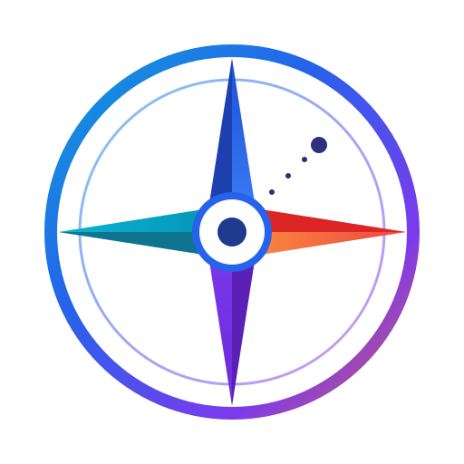

<div align="center">



# قطب‌نما · Qotbnama · Kompassnadel

**اندیشه‌ات را بهتر بشناس &nbsp;·&nbsp; Know your ideas better &nbsp;·&nbsp; Lerne deine Ideen besser kennen**

[](https://sadatpour.github.io/QotbNama)
[](LICENSE)
[](https://react.dev)
[](https://vitejs.dev)

---

**[ [فارسی](#-فارسی) · [English](#-english) · [Deutsch](#-deutsch) ]**

---

</div>

## 🇮🇷 فارسی

<div dir="rtl" align="right">

### قطب‌نما چیست؟

**قطب‌نما** یک ابزار آموزشی وب‌محور است که به شما کمک می‌کند جهت‌گیری سیاسی تقریبی خود را کشف کنید و درباره نظام‌ها و ایدئولوژی‌های سیاسی گوناگون به‌شکلی کاملاً بی‌طرف و آموزشی بیاموزید.

همه چیز در مرورگر اجرا می‌شود. **هیچ بک‌اند، دیتابیس، API، لاگین یا آنالیتیکسی وجود ندارد.** تمام داده‌ها به‌صورت محلی روی دستگاه شما پردازش و ذخیره می‌شوند.

---

### ✨ ویژگی‌ها

- 🧭 **پرسش‌نامه علمی** — ۳۵ سوال با مقیاس هفت‌درجه‌ای، برگرفته از Political Compass، Nolan Chart، WVS، ESS و Pew Research
- 📊 **نتایج بصری** — قطب‌نمای سیاسی تعاملی، نمودار رادار، نوارهای ابعادی و تحلیل تفصیلی بی‌طرف
- 🎓 **آموزش جذاب** — ۲۰ کارت موضوعی شامل تعریف، تاریخچه، مزایا، نقدها، مثال‌های واقعی و باورهای غلط رایج
- 🌍 **نقشه تعاملی جهان** — مشاهده نظام سیاسی کشورها روی نقشه رنگی
- 📈 **گزارش آمار شخصی** — تاریخچه آزمون‌های تکمیل‌شده، توزیع ربع‌ها و میانگین امتیازات
- 🖼️ **صادرات و اشتراک** — PDF، تصویر دانلودی، و اشتراک‌گذاری در شبکه‌های اجتماعی
- 🌗 **حالت روشن/تاریک**، موبایل‌فرست، دسترس‌پذیر و روان
- 🔒 **حریم خصوصی کامل** — بدون ثبت‌نام، بدون ردیابی

---

### 🚀 شروع سریع

```bash
# نصب وابستگی‌ها
npm install

# اجرای محیط توسعه
npm run dev

# ساخت نسخه تولید
npm run build
```

---

### 📁 ساختار پروژه

```
src/
├── components/
│   ├── ui/          # دکمه، کارت، آیکون، لوگو، …
│   ├── layout/      # نوار ناوبری، فوتر، تغییر تم
│   ├── charts/      # قطب‌نما (SVG)، رادار، نوارها
│   ├── quiz/        # مقیاس لیکرت، کارت سوال
│   ├── results/     # خلاصه، اشتراک، گزارش
│   ├── map/         # نقشه جهان، پنل کشور، MiniMap
│   └── stats/       # بخش آمار ارزیابی‌ها
├── context/         # ThemeContext، QuizContext
├── data/            # سوالات، ابعاد، موضوعات آموزشی
├── hooks/           # useDirection، useMediaQuery
├── i18n/            # تنظیمات چندزبانه
├── locales/         # fa.json، en.json، de.json
├── pages/           # صفحات اصلی
└── services/        # نمره‌دهی، ذخیره‌سازی، PDF، اشتراک
```

---

### 🎯 روش‌شناسی نمره‌دهی

آزمون **پنج بُعد** اساسی را می‌سنجد، هر بُعد با ۷ سوال (۳۵ سوال کل):

| بُعد | قطب منفی (−) | قطب مثبت (+) |
|------|-------------|-------------|
| اقتصادی | چپ | راست |
| اجتماعی | آزادی‌خواه | اقتدارگرا |
| دموکراتیک | غیردموکراتیک | دموکراتیک |
| نقش دولت | بازار آزاد | مداخله دولت |
| دین و حکومت | سنتی/دینی | سکولار |

</div>

---

## 🇬🇧 English

### What is Qotbnama?

**Qotbnama** (قطب‌نما, meaning *compass* in Persian) is a **static, privacy-first educational web app** that helps users discover their approximate political orientation through a short, research-based questionnaire — then teaches them about political systems and ideologies in a completely neutral, engaging way.

Everything runs in the browser. **No backend, no database, no API, no login, no analytics.** All data is processed and stored locally on the user's device via `localStorage`.

---

### ✨ Features

| Feature | Description |
|---------|-------------|
| 🧭 **Research-based Quiz** | 35 items on a 7-point Likert scale, adapted from Political Compass, Nolan Chart, WVS, ESS & Pew |
| 📊 **Visual Results** | Interactive political compass, radar chart, dimension bars, detailed neutral analysis |
| 🎓 **Educational Cards** | 20 topic cards — definition, history, pros, criticisms, real examples, common misconceptions |
| 🌍 **World Map** | Interactive map coloring countries by political system; featured mini-map on the home page |
| 📈 **Assessment Stats** | Local completion history, quadrant distribution, average scores across retakes |
| 🖼️ **Export & Share** | PDF report, PNG share card, social links (X, Facebook, LinkedIn, Telegram, WhatsApp) |
| 🌗 **Light / Dark mode** | System-aware, toggleable, persisted |
| 🌐 **Trilingual** | Persian (RTL), English, German — auto-detected, switchable |
| 🔒 **Full Privacy** | Zero tracking, zero sign-up, zero data sent anywhere |

---

### 🚀 Quick Start

#### Prerequisites

- Node.js **18+** (tested on Node 22)
- npm 9+

```bash
# Install dependencies
npm install

# Start dev server  (default → http://localhost:5173)
npm run dev

# Production build  (output → dist/)
npm run build

# Preview the build locally
npm run preview

# Type-check only
npm run typecheck

# Lint
npm run lint
```

---

### 🏗️ Tech Stack

| Concern | Choice |
|---------|--------|
| Framework | React 18 + TypeScript |
| Build | Vite 5 |
| Styling | Tailwind CSS 3 (class-based dark mode) |
| Routing | React Router 6 — **HashRouter** (no server rewrites) |
| Animation | Framer Motion |
| Charts | Recharts (radar) + custom SVG political compass |
| Map | react-simple-maps + world-atlas TopoJSON |
| i18n | i18next + react-i18next + browser language detector |
| PDF / Image | jsPDF + html2canvas |
| Storage | Browser `localStorage` (typed wrapper in `src/services/storage.ts`) |

---

### 📁 Project Structure

```
src/
├── components/
│   ├── ui/          # Button, Card, Icon, Logo, Accordion, SectionHeading, PageLoader
│   ├── layout/      # Navbar (with icons), Footer, Layout, ThemeToggle, LanguageSwitcher
│   ├── charts/      # PoliticalCompass (SVG), DimensionRadar (Recharts), DimensionBar
│   ├── quiz/        # LikertScale, QuestionCard
│   ├── results/     # ResultSummary, SharePanel, ShareCard, ResultReport
│   ├── map/         # WorldMap page components, CountryPanel, MapLegend, MiniMap (landing)
│   ├── stats/       # StatsSection — local completion history & analytics
│   └── education/   # TopicCard
├── context/         # ThemeContext, QuizContext (with completion history tracking)
├── data/            # questions.ts, dimensions.ts, education.ts, countries.ts
├── hooks/           # useDirection, useMediaQuery, useCountryName
├── i18n/            # i18next setup, language helpers, geo-detection
├── locales/         # fa.json · en.json · de.json  (all UI + content strings)
├── pages/           # Landing, Introduction, Questionnaire, Results, Education,
│                    # EducationDetail, WorldMap, SharePage, NotFound
└── services/        # scoring.ts, storage.ts (+ CompletionRecord), pdf.ts, share.ts
```

---

### 🎯 Scoring Methodology

Five dimensions, 7 items each (35 total). Items are **balanced-keyed** — each dimension mixes positive- and reverse-keyed statements to reduce acquiescence bias (standard in WVS / ESS instruments).

| Dimension | Negative pole (−) | Positive pole (+) |
|-----------|-------------------|-------------------|
| `economic` | Left | Right |
| `social` | Libertarian | Authoritarian |
| `democratic` | Non-democratic | Democratic |
| `state` | Free market | State intervention |
| `secular` | Traditional / religious | Secular |

**Computation pipeline** (`src/services/scoring.ts`):

1. Center the 7-point answer: `centered = index − 3` → range `[−3, 3]`
2. `contribution = centered × polarity × weight`
3. Normalize per dimension to `[−100, 100]` (divide by max possible absolute sum)
4. Unanswered items are skipped and excluded from the denominator
5. Political compass coordinates: `x = economic`, `y = social`
6. Top contributors = items with highest `|contribution|`
7. Recommended topics = education topics nearest the user's compass position (Euclidean distance)

---

### 🚀 Deployment

The app is a fully static bundle in `dist/` using **HashRouter** — routes like `/#/results` never hit the server.

| Host | How |
|------|-----|
| **GitHub Pages** | `npm run build` → publish `dist/` (e.g. via `gh-pages`). No extra config needed. |
| **Vercel** | Import repo; preset *Vite*; build `npm run build`; output `dist`. |
| **Netlify** | Build `npm run build`; publish directory `dist`. |
| **Shared hosting** | Upload contents of `dist/` to your web root. |

---

### 🔐 Privacy

- No personal information requested — no account, no login
- No analytics or third-party tracking
- Answers, theme, language, and completion history stored only in `localStorage` (keys prefixed `qotbnama.`)
- Clearing data: click **Retake** on the results page, or clear `localStorage` in DevTools

---

### 🎨 Customization

| Goal | File(s) |
|------|---------|
| Add / change questions | `src/data/questions.ts` + `questions.*` key in each locale |
| Tune weights / polarity | `src/data/questions.ts` |
| Adjust dimensions | `src/data/dimensions.ts` |
| Add education topics | `src/data/education.ts` + `education.topics.*` in each locale |
| Change colors / gradients | `tailwind.config.js` + `src/index.css` CSS variables |
| Replace logo | `public/logo.svg` (+ `public/og-image.svg` for social previews) |
| Add a language | Add `src/locales/<code>.json` → register in `src/i18n/index.ts` |

---

### ♿ Accessibility

- Semantic landmarks, skip link, and `aria-*` on interactive widgets
- Full **keyboard support** in the quiz: `1–7` select, arrow keys navigate (RTL-aware)
- Visible focus rings, AA-oriented contrast in both themes
- `prefers-reduced-motion` support — disables animations when the OS requests it

---

## 🇩🇪 Deutsch

### Was ist Qotbnama?

**Qotbnama** (قطب‌نما, auf Persisch *Kompass*) ist eine **statische, datenschutzfreundliche Bildungs-Web-App**, die Nutzerinnen und Nutzern dabei hilft, ihre ungefähre politische Ausrichtung mithilfe eines kurzen, forschungsbasierten Fragebogens zu entdecken — und anschließend auf völlig neutrale, ansprechende Weise politische Systeme und Ideologien kennenzulernen.

Alles läuft im Browser. **Kein Backend, keine Datenbank, kein API, kein Login, keine Analyse.** Alle Daten werden lokal auf dem Gerät des Nutzers verarbeitet und gespeichert.

---

### ✨ Funktionen

- 🧭 **Forschungsbasierter Fragebogen** — 35 Aussagen auf einer 7-Punkte-Likert-Skala, adaptiert aus Political Compass, Nolan Chart, WVS, ESS und Pew Research
- 📊 **Visuelle Ergebnisse** — Interaktiver politischer Kompass, Radardiagramm, Dimensionsbalken und detaillierte neutrale Analyse
- 🎓 **Interaktive Lernkarten** — 20 Themenkarten mit Definition, Geschichte, Vor- und Nachteilen, realen Beispielen und häufigen Missverständnissen
- 🌍 **Interaktive Weltkarte** — Länder nach politischem System eingefärbt; Mini-Karte auf der Startseite
- 📈 **Bewertungsstatistiken** — Lokale Abschlusshistorie, Quadrantenverteilung, Durchschnittswerte
- 🖼️ **Export & Teilen** — PDF-Bericht, PNG-Bild, Social-Media-Links
- 🌗 **Hell-/Dunkel-Modus**, mobiloptimiert, barrierefrei
- 🔒 **Vollständiger Datenschutz** — Kein Tracking, keine Registrierung

---

### 🚀 Schnellstart

```bash
# Abhängigkeiten installieren
npm install

# Entwicklungsserver starten  (Standard → http://localhost:5173)
npm run dev

# Produktions-Build erstellen  (Ausgabe → dist/)
npm run build
```

---

### 🏗️ Technologie-Stack

| Bereich | Wahl |
|---------|------|
| Framework | React 18 + TypeScript |
| Build-Tool | Vite 5 |
| Styling | Tailwind CSS 3 |
| Routing | React Router 6 (HashRouter) |
| Animation | Framer Motion |
| Diagramme | Recharts + SVG-Kompass |
| Karte | react-simple-maps + world-atlas |
| i18n | i18next + react-i18next |
| PDF / Bild | jsPDF + html2canvas |

---

### 🌐 Lokalisierung

- **Persisch (`fa`, RTL)** · **Englisch (`en`)** · **Deutsch (`de`)**
- Erkennung: gespeicherte Präferenz → Browser-Sprache → IP-Geo → Fallback
- Alle nutzersichtigen Texte — UI, Fragen, Dimensionen, Bildungsinhalte — befinden sich in `src/locales/{fa,en,de}.json`

#### Sprache hinzufügen

1. `src/locales/<code>.json` erstellen (bestehende Datei kopieren und übersetzen)
2. In `src/i18n/index.ts` registrieren (`resources`, `SUPPORTED_LANGUAGES`, `DIRECTION`)
3. Korrekte Schreibrichtung (`dir`) setzen: `rtl` oder `ltr`

---

### 📄 Lizenz

Dieses Projekt steht unter der [MIT-Lizenz](LICENSE) und darf frei verwendet, verändert und verbreitet werden.

---

<div align="center">

**قطب‌نما** ist mit ❤️ für Bildung gebaut — neutral, offen, privat.

_Qotbnama is built with ❤️ for education — neutral, open, private._

ساخته‌شده با ❤️ برای آموزش — بی‌طرف، آزاد، خصوصی.

</div>
